# Meraki MV Custom PPE Detection with Machine Learning

This project uses a **local** YOLOv8 custom PPE model to detect the presence of PPE with a Meraki MV Camera. PPE Zones are defined to specify what a full 'PPE Kit' looks like per camera. If one or more PPE violations are detected, a Microsoft Teams message is sent to a notification space with an attached snapshot.

Supported PPE:
* Safety Vest
* Safety Helmets
* Safety Goggles

PPE Detection States:
* `Valid`: Full Kit Detected
* `Invalid`: One or More Missing PPE Pieces Detected (send Microsoft Teams Message)
* `Unknown`: Unable to Detect All Pieces of PPE in Kit

**Note**: Due to the nature of ML, this model is highly trained for the original use case. Accuracy and performance millage will vary.
Refer to the [image dataset](https://universe.roboflow.com/cisco-systems-c21fi/devnet-custom-mv-ppe-detection) to view the raw image set and information around model accuracy, class ids, etc. Raw image set is **NOT** included in this repo.

Model Performance Graphs can be found under `ppe_dataset/`, for example:

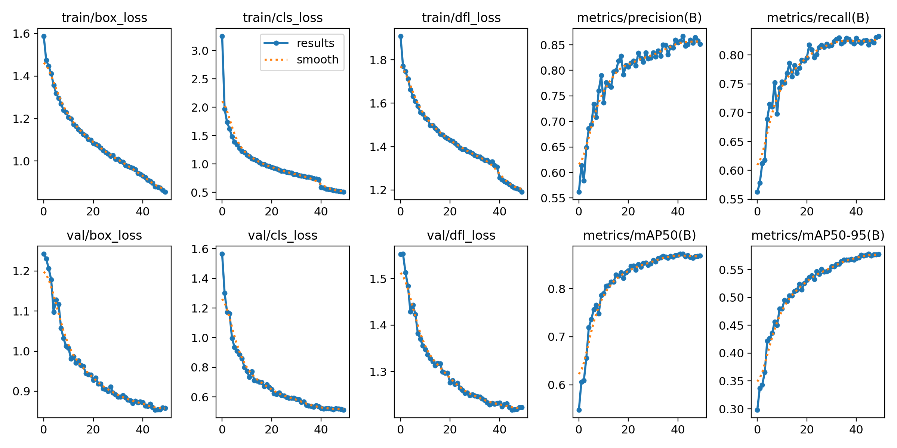

## Contacts
* Trevor Maco 
* Mark Orszycki

## Solution Components
* Meraki MV
* MQTT
* YOLOv8
* Microsoft Teams
* Python 3.11
* Flask

## Prerequisites
#### Meraki API Keys
In order to use the Meraki API, you need to enable the API for your organization first. After enabling API access, you can generate an API key. Follow these instructions to enable API access and generate an API key:
1. Login to the Meraki dashboard
2. In the left-hand menu, navigate to `Organization > Settings > Dashboard API access`
3. Click on `Enable access to the Cisco Meraki Dashboard API`
4. Go to `My Profile > API access`
5. Under API access, click on `Generate API key`
6. Save the API key in a safe place. The API key will only be shown once for security purposes, so it is very important to take note of the key then. In case you lose the key, then you have to revoke the key and a generate a new key. Moreover, there is a limit of only two API keys per profile.

> For more information on how to generate an API key, please click [here](https://developer.cisco.com/meraki/api-v1/#!authorization/authorization). 

> Note: You can add your account as Full Organization Admin to your organizations by following the instructions [here](https://documentation.meraki.com/General_Administration/Managing_Dashboard_Access/Managing_Dashboard_Administrators_and_Permissions).

#### Meraki Camera MQTT API
**MQTT Broker**: MQTT-based protocols use a publish-subscribe connection between the client and server. In the case of MV Sense, the server is continuously pushing messages to the MV smart cameras so the device can respond instantly. This leads to a real-time feed of data coming from your camera. Follow these steps to configure a MQTT broker:
1. Start by navigating to `Cameras > Monitor > Cameras` and selecting the camera you would like to enable MV Sense on.
2. Once the camera is selected, go to `Settings > Sense`.
3. Click `Enabled`.
4. To enable MQTT on your camera and create a new MQTT broker configuration click `Add or edit MQTT Brokers`.

**Note**: For testing/trial you can find a public broker [here](https://github.com/mqtt/mqtt.org/wiki/public_brokers).

> For more information on using MQTT with Meraki cameras, please click [here](https://developer.cisco.com/meraki/mv-sense/#!mqtt/configuring-mqtt-in-the-dashboard).

> Note: If this is your organization's first time using MV Sense, you will have 10 free perpetual licenses available to use. If you have exceeded this 10 free license count, you must activate more licenses by navigating to `Organization > Configure > License Info` and claim more licenses.

#### Microsoft Teams
1. Follow the guide [here](https://learn.microsoft.com/en-us/microsoftteams/platform/webhooks-and-connectors/how-to/add-incoming-webhook?tabs=dotnet) to set up a Microsoft Teams Incoming Webhook for a target space.
2. Note the Webhook URL

#### Ngrok
To send annotated snapshots in Microsoft Teams messages, it's required for images to be available at a public URL. A separate flask app (`serve_images.py`) can be run on http://localhost:3500 to serve images from the `static/hosted_images` directory, but ngrok is required to make the app publicly reachable. It's recommened in production to use a cloud based solution for uploading and using the images.

Follow these instructions to set up ngrok:
1. Create a free account or login to [Ngrok](https://ngrok.com/).
2. Retrieve your auth token by navigating to `Getting Started` > `Your Authtoken` on the menu on the left-hand side. Copy the token on this page.
3. Then install the client library depending on your OS [here](https://ngrok.com/download).
4. Once you have ngrok installed, update the ngrok configuration file with your auth token by running the following command on the terminal/command prompt: 
```
ngrok authtoken [yourtoken]
```
replacing [yourtoken] with the authtoken you copied in Step 2.

5. Start the ngrok tunnel for port 3500 with the command:
```
ngrok http 3500
```
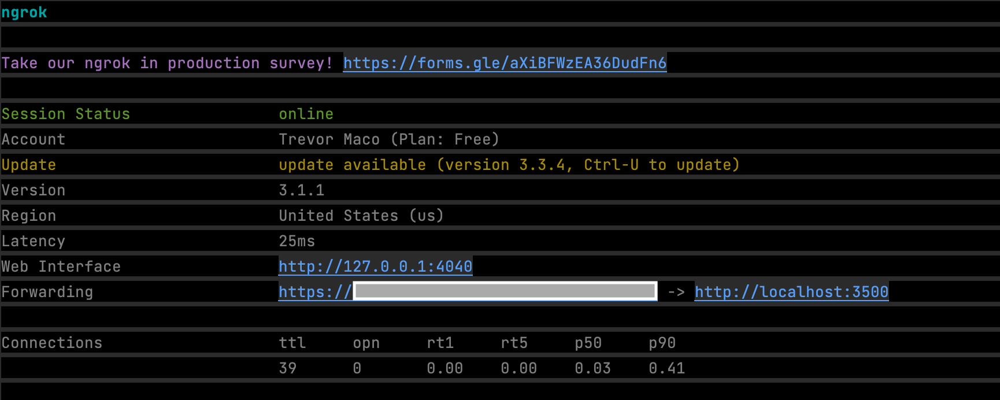

#### cameras.json and ppe_zones.json

A central part of the app is defining camera's to observe and what defines a full 'PPE Kit'.

* `cameras.json`:

Define which cameras to run the model on here. Refer to the image below for the definition of each field. 

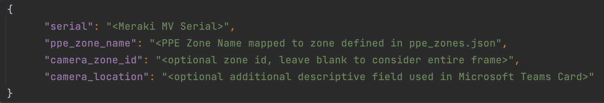

**Note**: 'ppe_zone_name' must map to a name defined in `ppe_zones.json`. 'camera_location' is an optional additional field for verbosity in the Microsoft Teams Card (`static/cards/default_card.json`). More fields can easily be added to the card (with some reworking of the code as well).

* `ppe_zones.json`

Define new PPE Zones and what PPE Items to enforce here. Refer to the image below for the definition of each field.

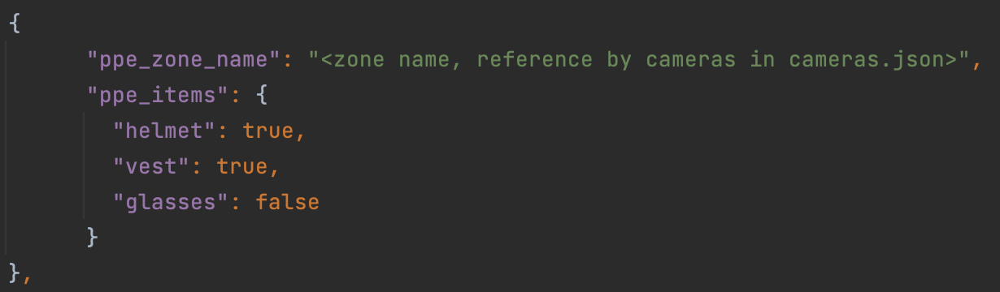

**Note**: To enforce PPE Items, enter `true`, otherwise enter `false`.

#### Meraki Camera Zone (Optional)
A Camera Zone can optionally be specified. If specified, only people detected in the zone will trigger the PPE detection.
1. Start by navigating to `Cameras > Monitor > Cameras` and selecting the camera you would like to create a zone on.
2. Once the camera is selected, go to `Settings > Zones`.
3. Create a new zone, provide a name and detection overlap.

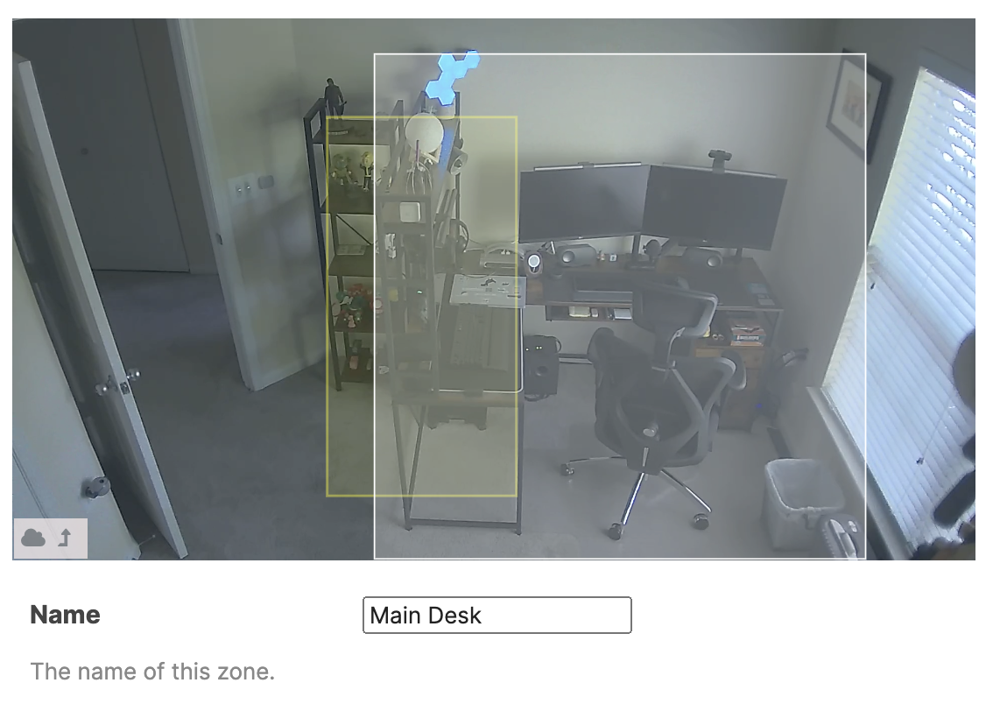

4. Note the number of the zone at the end of the MQTT topic created for the new zone

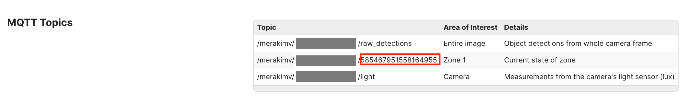

#### Meraki Camera RTSP (Optional)
This app also includes a dashboard to view live snapshot annotations compared to live video traffic from the camera. In order to get the live feed (via RTSP), ensure the MV is locally reachable from the app. 

**Note**: locally reachable MVs are not strictly required for the primary solution, just for the RTSP stream on the dashboard.

## Installation/Configuration
1. Clone this repository with `git clone [repository name]`
2. Add the Meraki API Token and Meraki Org Name with the cameras to `config.py`:
```python
MERAKI_API_KEY = ""
MERAKI_ORG_NAME = ""
```
3. Add the MQTT Server URL and Port configured on the Meraki Dashboard:
```python
# MQTT (snapshot mode)
MQTT_SERVER = ""
MQTT_PORT = 0
```
4. Add the primary flask app url (for `app.py`) to `config.py`. By default, the app can run without being exposed to the internet at the default value shown below. This value is important for API communication between `app.py` and `ppe_detection`. Only deviate from the default if `app.py` is running in a different place than the default location.
```python
# PPE Detection/Primary Flask URL (public/private)
APP_URL = "http://127.0.0.1:4000"
```
5. Add the public URL for the flask app serving images to Microsoft Teams Messages in  `config.py`. This URL is most likely the Ngrok URL from the prerequisites.
```python
# Serving Images Flask URL (public)
SERVE_IMAGES_URL = ""
```
6. Add the Microsoft Teams Inbound Webhook URL and set the amount of time to retain the images served to Microsoft Teams Messages (only relevant if serving images with flask app previously discussed)
```python
# Microsoft Teams Integration
MICROSOFT_TEAMS_URL = ""
IMAGE_RETENTION_DAYS = 1
```
7. Set up a Python virtual environment. Make sure Python 3 is installed in your environment, and if not, you may download Python [here](https://www.python.org/downloads/). Once Python 3 is installed in your environment, you can activate the virtual environment with the instructions found [here](https://docs.python.org/3/tutorial/venv.html).
8. Install the requirements with `pip3 install -r requirements.txt`

## Usage
To run the program, there are several pieces of code to execute.

Start by running the primary flask app `app.py`. This connects with `ppe_detection.py` and launches the visualization dashboard.
```
$ python3 app.py
```

Then launch secondary flask app `serve_images.py`. This app makes hosted images available to Microsoft Teams Messages.
```
$ python3 serve_images.py
```

Finally, run `ppe_detection.py`. This starts the MQTT server, and runs the PPE Detection on snapshots taken when a person is detected.
```
$ python3 ppe_detection.py
```

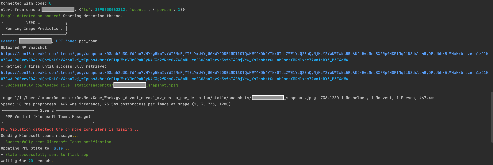

When a violation is detected, a Microsoft Teams Card is sent which looks like:

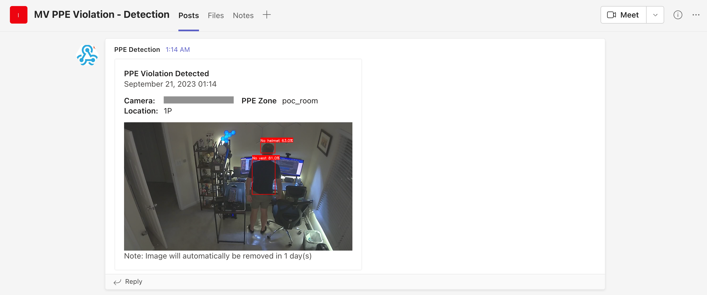

Navigate to the url of `app.py` to select a camera, and view the live visualization dashboard. The left hand video shows RTSP live video, and the right side shows the most recent annotated snapshot.

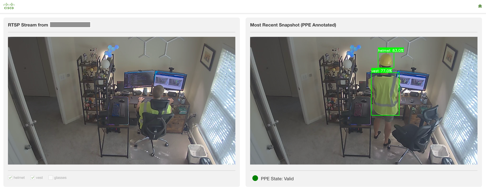

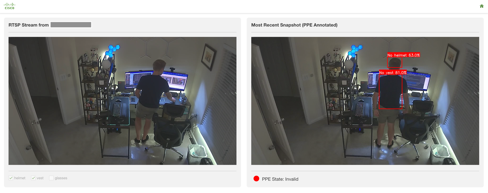

The most recent snapshots, annotated images, and hosted images can be found in the following directories:

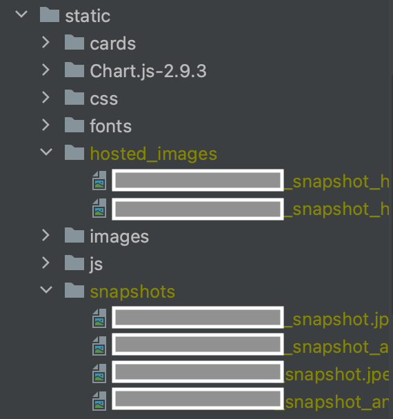

# Screenshots


### LICENSE

Provided under Cisco Sample Code License, for details see [LICENSE](LICENSE.md)

### CODE_OF_CONDUCT

Our code of conduct is available [here](CODE_OF_CONDUCT.md)

### CONTRIBUTING

See our contributing guidelines [here](CONTRIBUTING.md)

#### DISCLAIMER:
<b>Please note:</b> This script is meant for demo purposes only. All tools/ scripts in this repo are released for use "AS IS" without any warranties of any kind, including, but not limited to their installation, use, or performance. Any use of these scripts and tools is at your own risk. There is no guarantee that they have been through thorough testing in a comparable environment and we are not responsible for any damage or data loss incurred with their use.
You are responsible for reviewing and testing any scripts you run thoroughly before use in any non-testing environment.